# PlanningSpec - plateforme de planification par contraintes

PlanningSpec est une application web pour decrire, resoudre et publier des plannings sous contraintes. Le projet combine:

- un frontend React pour creer, importer, editer et suivre les planifications;
- une API Node.js/Express qui valide le langage `.planning`, genere un modele MiniZinc, lance les solveurs et persiste les resultats;
- une base MySQL pour les utilisateurs, les planifications, les executions, les logs et les versions de solutions;
- MiniZinc comme moteur principal de resolution;
- un backend Spring Boot/OptaPlanner optionnel, active uniquement quand le profil Docker `optaplanner` est demande.

Le cas d'usage principal du depot est la planification de soutenances, mais le langage reste generique: activites, ressources, roles, contraintes et preferences sont declares dans le fichier `.planning`.

## Structure Du Depot

```text
.
├── src/
│   ├── frontend/                         # interface React
│   └── backend/
│       ├── packages/
│       │   ├── language/                 # grammaire Langium + génération MiniZinc
│       │   ├── server/                   # API Express + exécutions MiniZinc
│       │   ├── cli/                      # outils CLI
│       │   └── extension/                # extension VS Code
│       └── planning-solver-springboot/   # solveur OptaPlanner optionnel
├── exp_planning/                         # exemples et jeux de données .planning
├── deployment/                           # Docker Compose, Dockerfiles, nginx
├── docs/
│   ├── README_DOCKER.md                  # guide Docker détaillé
│   └── RELEASE_TAGGING.md                # procédure de versioning
├── run.sh                                # point d'entrée Docker
├── package.json                          # scripts du monorepo pnpm
└── pnpm-workspace.yaml
```

## Prerequis

Pour le lancement Docker:

- Docker et Docker Compose v2;
- acces reseau au premier build pour telecharger les images et le bundle MiniZinc.

Pour le lancement local hors Docker:

- Node.js `20.10+`;
- pnpm `10+` via Corepack;
- MySQL `8+`;
- MiniZinc installe et accessible par `minizinc`;
- Java `25` et Maven seulement si vous lancez le backend OptaPlanner localement.

Docker est le mode recommande, car il installe MiniZinc dans le conteneur backend et configure MySQL, le frontend, les volumes et les profils d'exploitation.

## Lancement Local Hors Docker

1. Installer les dependances a la racine:

```bash
corepack enable
corepack use pnpm@10.31.0
pnpm install
```

2. Preparer MySQL. En developpement, vous pouvez utiliser un serveur MySQL local ou lancer seulement MySQL via Docker. L'utilisateur configure doit pouvoir creer la base au premier demarrage, ou bien la base doit exister avant de lancer l'API.

Exemple SQL local:

```sql
CREATE DATABASE planning_spec CHARACTER SET utf8mb4 COLLATE utf8mb4_unicode_ci;
CREATE USER 'planify'@'localhost' IDENTIFIED BY 'change_me';
GRANT ALL PRIVILEGES ON planning_spec.* TO 'planify'@'localhost';
FLUSH PRIVILEGES;
```

3. Creer le fichier d'environnement du serveur Express:

```bash
cp src/backend/packages/server/.env.example src/backend/packages/server/.env
```

Puis adapter au minimum:

```env
PORT=4000
ALLOWED_ORIGINS=http://localhost:3000
MINIZINC_PATH=minizinc
MINIZINC_DEFAULT_SOLVER=chuffed
MYSQL_HOST=127.0.0.1
MYSQL_PORT=3306
MYSQL_USER=planify
MYSQL_PASSWORD=change_me
MYSQL_DATABASE=planning_spec
```

4. Lancer le backend et le frontend:

```bash
pnpm dev:backend
```

Dans un autre terminal:

```bash
pnpm dev:frontend
```

Ou lancer les deux avec:

```bash
pnpm dev
```

5. Verifier:

```bash
curl http://localhost:4000/api/health
curl http://localhost:4000/api/solvers
```

Le frontend est disponible sur `http://localhost:3000`.

## Lancement Docker

Le guide complet est dans [docs/README_DOCKER.md](docs/README_DOCKER.md). Les commandes ci-dessous sont le resume operationnel.

### Environnements

Le script `run.sh` utilise trois fichiers d'environnement:

- `.env.dev` pour le developpement;
- `.env.release` pour une release/staging proche production;
- `.env.prod` pour la production.

Si le fichier n'existe pas, `run.sh` le cree depuis `.env.<env>.example`.

```bash
./run.sh env dev
./run.sh env release
./run.sh env prod
```

Apres creation, modifiez les secrets, les ports publics et les origines CORS. Ne commitez jamais les fichiers `.env.*` reels.

### Developpement Docker

```bash
./run.sh dev
```

Equivalence explicite:

```bash
./run.sh start all dev
```

Ports par defaut:

- frontend: `http://localhost:3000`;
- backend: `http://localhost:4000`;
- Adminer: `http://localhost:8081`;
- phpMyAdmin: `http://localhost:8082`;
- Vault dev: `http://localhost:8200`;
- MySQL: `localhost:3306`.

Le profil dev monte le code source dans les conteneurs et utilise le hot reload.

### Release / Staging

```bash
./run.sh release
```

Ou:

```bash
./run.sh start release
```

Port par defaut:

- application web: `http://localhost:8080`.

En release, le frontend React est servi par nginx, l'API reste derriere le proxy `/api`, MySQL n'est pas expose publiquement, et les conteneurs applicatifs sont plus proches des conditions production.

Si vous accedez a la release depuis une autre machine, ajoutez l'origine publique dans `ALLOWED_ORIGINS`, par exemple:

```env
ALLOWED_ORIGINS=http://localhost:8080,http://192.168.1.10:8080
FRONTEND_URL=http://192.168.1.10:8080
```

### Production

```bash
./run.sh prod
```

Ou:

```bash
./run.sh start prod
```

Port par defaut:

- application web: `http://localhost` ou le domaine configure.

En production, adaptez au minimum:

- `FRONTEND_URL`;
- `ALLOWED_ORIGINS`;
- les mots de passe MySQL;
- les limites CPU/memoire si necessaire;
- la strategie de sauvegarde.

Ne lancez pas `docker compose down -v` sur une instance contenant des donnees utiles: cela supprime les volumes, donc la base MySQL et le workdir MiniZinc.

### Profils Docker

`optaplanner`: demarre le service Spring Boot OptaPlanner.

```bash
./run.sh start all dev --with-optaplanner
./run.sh start optaplanner dev
./run.sh optaplanner logs dev
./run.sh optaplanner stop dev
```

`db-admin`: active phpMyAdmin en release, ponctuellement et lie par defaut a `127.0.0.1`.

```bash
./run.sh release phpmyadmin
```

`vault`: active Vault local en release si vous voulez tester une integration de secrets. En production reelle, preferez un Vault externe ou le gestionnaire de secrets de l'infrastructure.

### Commandes D'exploitation

```bash
./run.sh dev ps
./run.sh logs backend
./run.sh logs frontend
./run.sh dev minizinc
./run.sh dev solvers
./run.sh dev mysql-ping
./run.sh prod backup ./backup-planify.sql
./run.sh prod restore ./backup-planify.sql
./run.sh prod down
```

Pendant qu'une resolution est en cours sur une instance release/production, evitez de redemarrer ou d'arreter le backend. Les solutions et logs deja sauvegardes restent en base, mais le processus MiniZinc enfant s'arrete si le conteneur backend tombe.

## Guide Utilisateur Avec Captures

Les captures ci-dessous ont ete prises sur `http://localhost:8080` avec un compte de demonstration dedie au cas des soutenances 2026. Les donnees visibles sont anonymisees: aucun nom reel d'enseignant ou d'etudiant n'apparait dans les ecrans.

Compte de demonstration:

- nom: `Regent Regent`;
- email: `regent@gmail.com`;
- mot de passe: `Regent@2026!`;
- planning prepare: `Soutenances MI/MA 2026 - demonstration`.

Le fichier `.planning` anonymise utilise pour l'import direct est disponible dans [docs/examples/soutenances_ma_mi_2026_anonymise.planning](docs/examples/soutenances_ma_mi_2026_anonymise.planning).

### 1. Se Connecter

Ouvrez `http://localhost:8080`, allez sur `Se connecter`, puis utilisez les identifiants Regent ci-dessus. Ce compte permet de reprendre les captures sans toucher aux autres planifications en cours.


### 2. Verifier Le Tableau De Bord Et La Liste

Le tableau de bord donne l'etat global du compte. La page `Planifications` liste le planning 2026 de demonstration avec son statut, sa progression et l'action `Voir`.

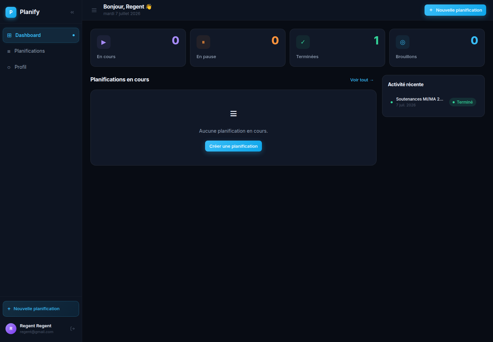

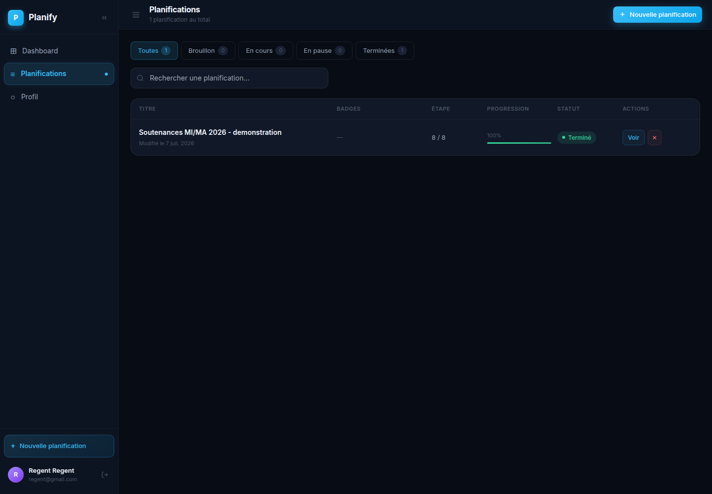

### 3. Creer Une Planification Guidee

Pour un nouveau cas, cliquez sur `Nouvelle planification`, donnez un titre, puis ouvrez l'editeur guide. Le wizard comporte 8 etapes: informations, horizon, activites, ressources, roles, contraintes, preferences et recapitulatif.

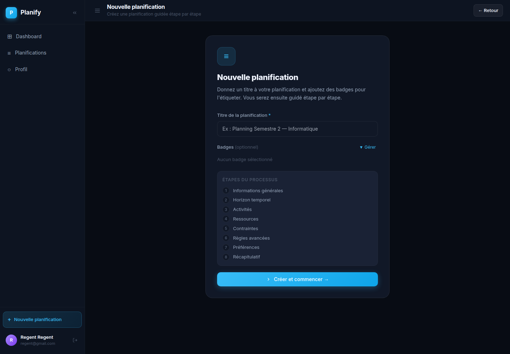

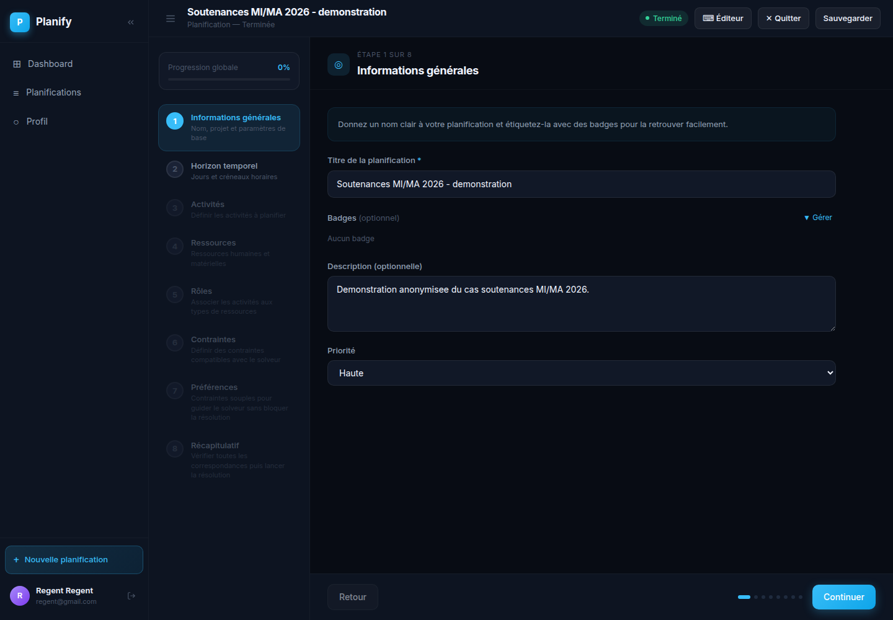

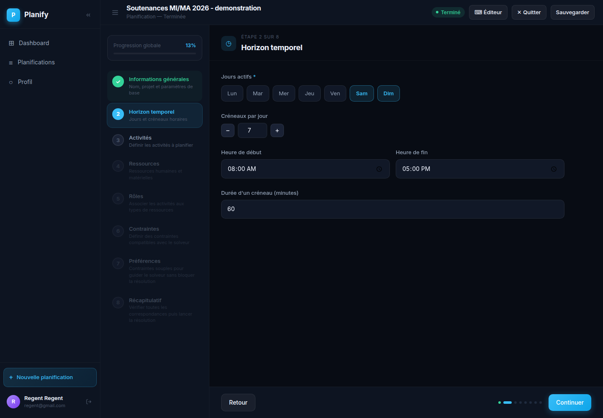

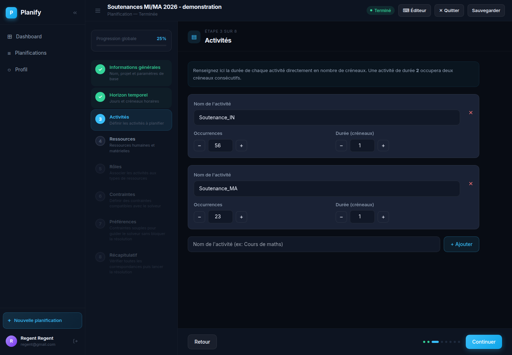

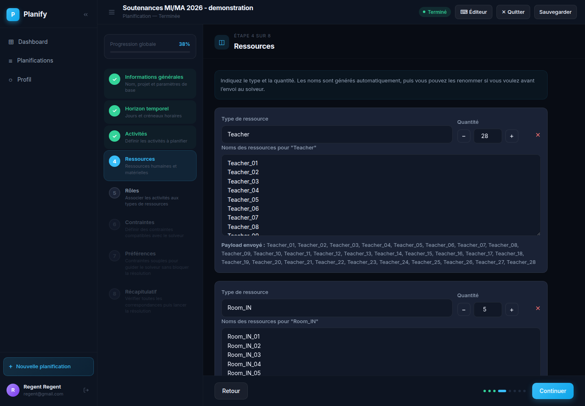

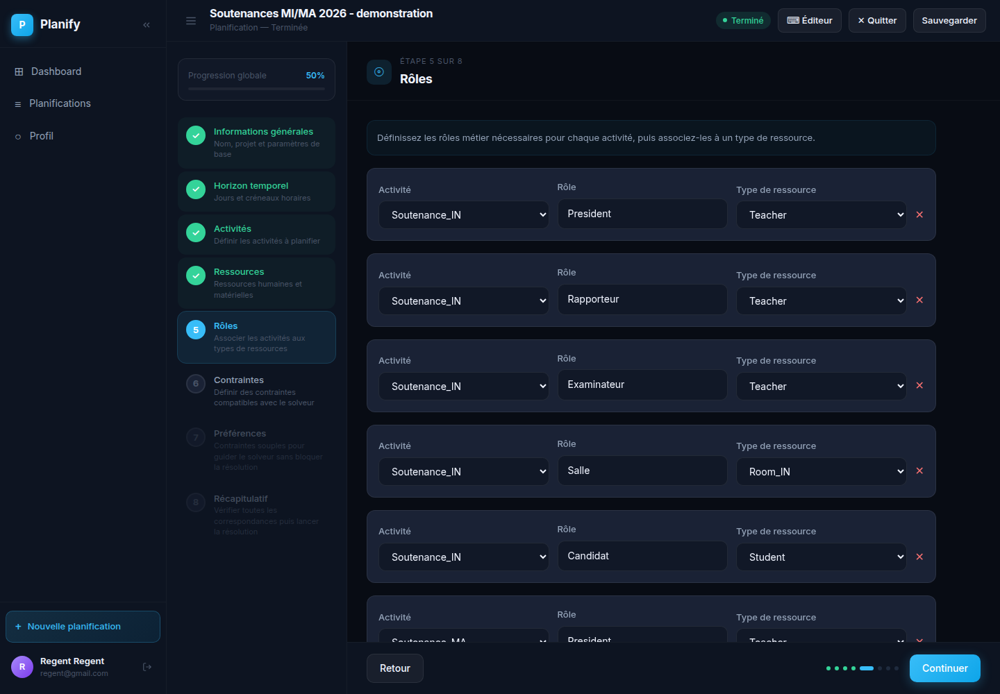

### 4. Ajouter Les Contraintes

L'etape `Contraintes` contient des boutons pour ajouter simplement les regles fortes: cardinalite, exclusivite, affectation imposee/interdite, precedences, fenetres temporelles, ressource requise, jour impose ou regroupement sur une seule journee. Chaque bloc peut etre active/desactive et complete via des listes deroulantes.

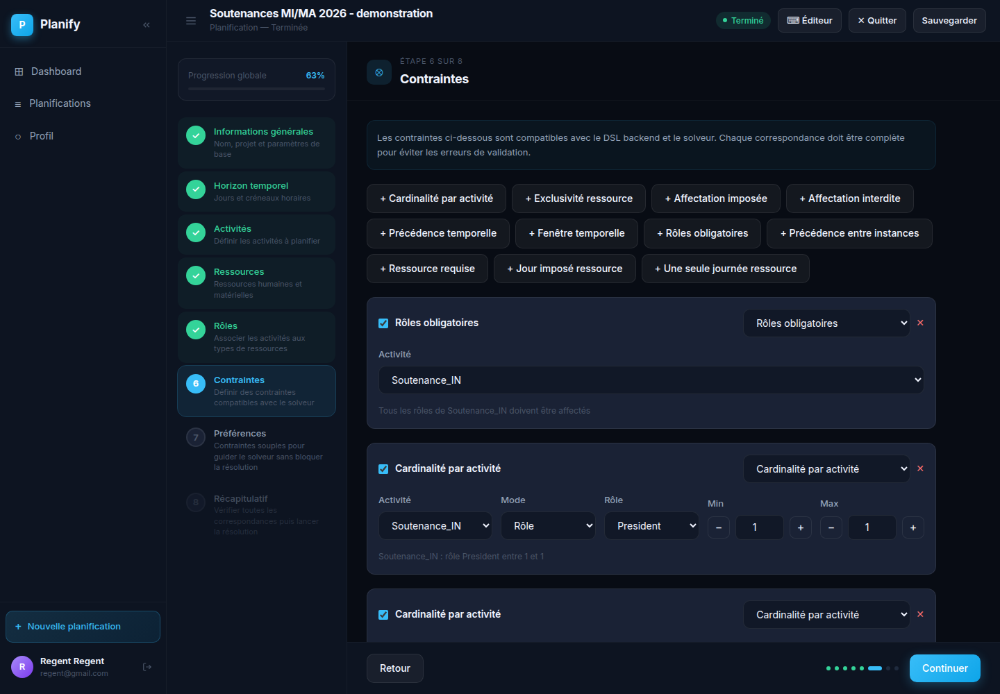

### 5. Ajouter Les Preferences

Les preferences sont des contraintes souples. Elles guident le solveur avec un poids, sans bloquer la resolution si elles ne sont pas toutes satisfaites. L'utilisateur peut ajouter une preference de date, une ressource preferee, une stabilite de salle ou un planning plus compact.

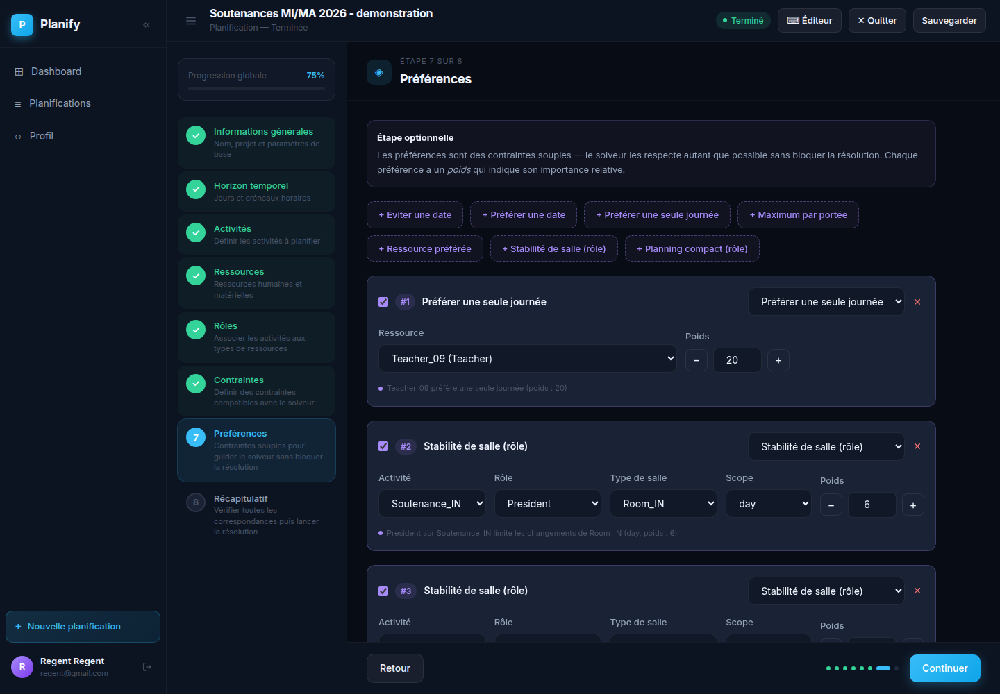

### 6. Verifier Le Recapitulatif

Le recapitulatif permet de relire les donnees avant lancement: jours, activites, ressources, roles, contraintes, preferences et solveur.

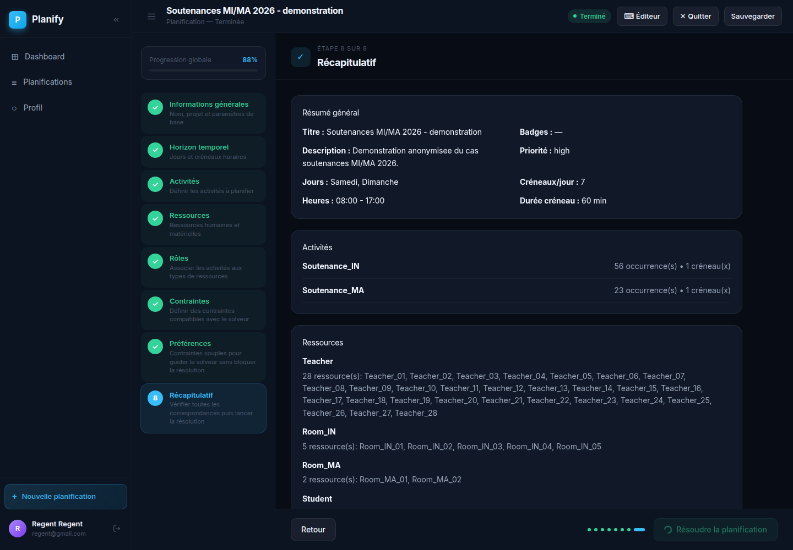

### 7. Alternative: Importer Directement Un `.planning`

Au lieu de remplir toutes les etapes, ouvrez l'editeur lateral et cliquez sur `Import`. Selectionnez un fichier `.planning` valide, par exemple [docs/examples/soutenances_ma_mi_2026_anonymise.planning](docs/examples/soutenances_ma_mi_2026_anonymise.planning). L'application synchronise ensuite la source avec le wizard.

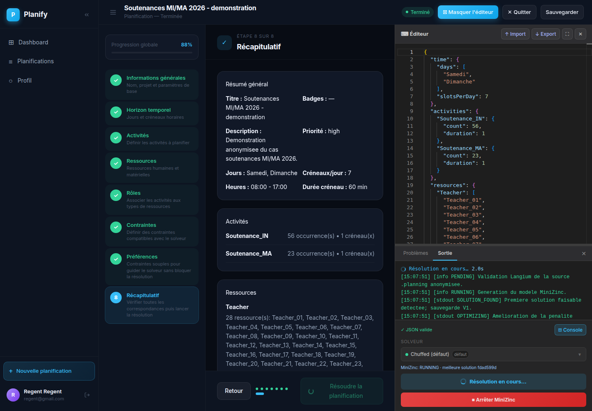

### 8. Suivre L'execution Dans La Console

Quand la resolution demarre, la console affiche la validation, la generation MiniZinc, les logs du solveur, les solutions detectees et l'etat courant. Dans cette capture, l'execution est simulee pour la documentation Regent, avec le meme format de logs qu'une execution reelle.


### 9. Consulter L'historique Des Solutions

Chaque solution exploitable est sauvegardee comme version. L'historique permet de comparer une version intermediaire et la meilleure version courante, puis de generer un rapport depuis une version precise.

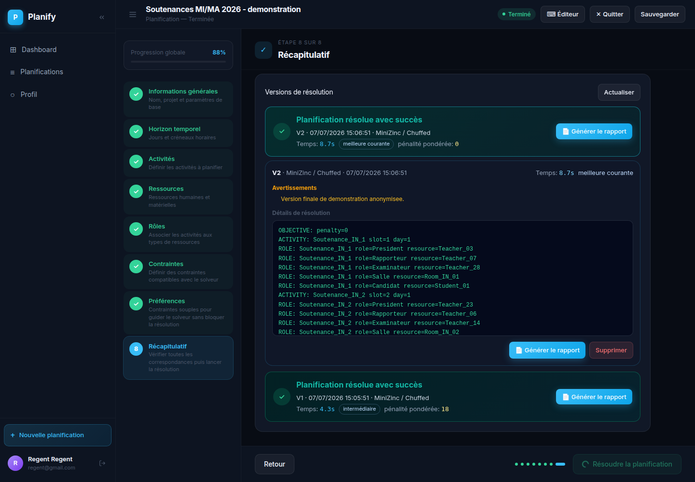

### 10. Lire Le Rapport

Le rapport rend la solution visible sous forme calendrier, tableau ou vue par ressource. Les actions en haut permettent d'exporter en Markdown, d'imprimer ou de passer dans le designer PDF.

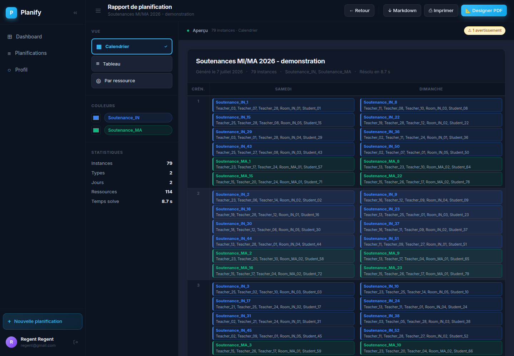

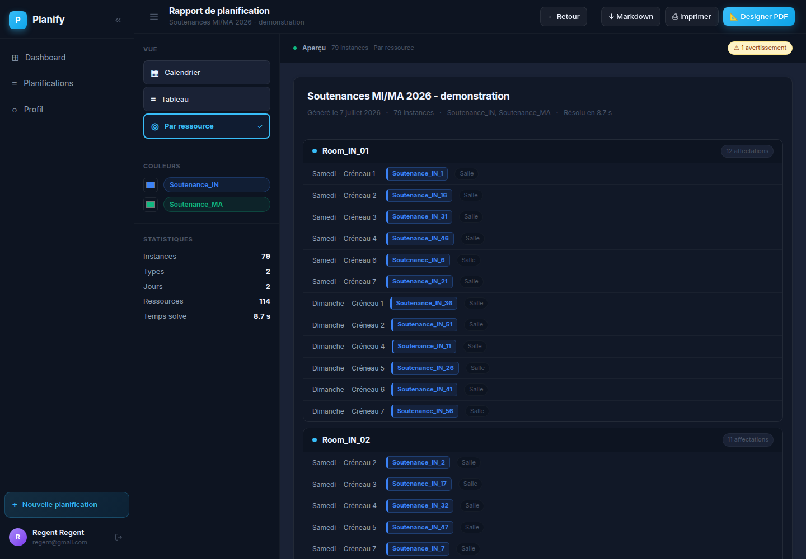

## Comment Fonctionne Le Planificateur

Le flux principal est le suivant:

1. L'utilisateur cree une planification dans l'interface ou importe un fichier `.planning`.
2. Le frontend conserve les donnees sous forme structuree et sous forme source `.planning`.
3. Au lancement, le backend valide la source avec Langium.
4. Le generateur transforme le `.planning` en modele MiniZinc.
5. Le backend lance MiniZinc avec le solveur choisi (`chuffed`, `gecode`, `highs`, etc.).
6. Les logs stdout/stderr sont sauvegardes en MySQL.
7. Chaque solution exploitable est sauvegardee comme version de solution.
8. Le frontend suit l'execution en temps reel via SSE et peut afficher les solutions intermediaires.
9. Le rapport est genere depuis la meilleure solution sauvegardee: calendrier, tableau, vue par ressource, impression et export Markdown.

La route applicative principale est:

```text
POST /api/plannings/:id/solve
```

Elle demarre une execution MiniZinc asynchrone et retourne un `executionId`. Les evenements sont ensuite lus via:

```text
GET /api/plannings/:id/executions/:executionId/events
```

Il existe aussi une route de resolution directe:

```text
POST /api/solve
```

Elle est utile pour tester une source, mais l'usage normal de l'application passe par les planifications sauvegardees.

### Statuts D'execution

Les statuts les plus importants sont:

- `PENDING`: execution creee, pas encore lancee;
- `RUNNING`: MiniZinc est en cours;
- `SOLUTION_FOUND`: au moins une solution a ete sauvegardee;
- `OPTIMIZING`: le solveur continue et cherche une meilleure solution;
- `OPTIMAL`: MiniZinc a prouve l'optimalite;
- `COMPLETED`: execution terminee avec solution, sans preuve d'optimalite explicite;
- `STOPPED`: arret demande par l'utilisateur;
- `UNSATISFIABLE`: aucune solution ne respecte toutes les contraintes fortes;
- `FAILED`: erreur de validation, generation ou execution;
- `UNKNOWN`: etat non conclusif, souvent apres interruption ou redemarrage backend.

Par defaut, aucun timeout n'est applique au solveur. Une limite peut etre donnee explicitement avec `solverTimeLimitSeconds`.

### MiniZinc

MiniZinc est le moteur principal.

Le modele genere contient:

- `start_time`: le creneau de debut de chaque instance d'activite;
- `assignment`: les ressources affectees a chaque instance;
- `role_assignment`: les ressources affectees a chaque role d'une activite;
- les contraintes fortes issues de `constraints`;
- une penalite issue de `preferences`.

Si le fichier contient des preferences, le solveur minimise la penalite. Sinon, il cherche simplement une solution satisfaisant les contraintes fortes. Le makespan n'est pas optimise par defaut afin de ne pas augmenter fortement la complexite.

La sortie MiniZinc est structuree avec des lignes du type:

```text
OBJECTIVE: penalty=0
ACTIVITY: Soutenance_IN_1 slot=1 day=1
ASSIGNMENT: Soutenance_IN_1 resource=Room_IN_1
ROLE: Soutenance_IN_1 role=President resource=Teacher_01
```

Ces lignes sont parsees pour construire les rapports.

### OptaPlanner

OptaPlanner est optionnel. Il est separe du backend MiniZinc et ne demarre que si le profil Docker `optaplanner` est active ou si vous lancez le service Spring Boot localement.

En Docker:

```bash
./run.sh start all dev --with-optaplanner
```

En local:

```bash
cd src/backend/planning-solver-springboot
mvn spring-boot:run
```

Puis:

```bash
curl http://localhost:8084/api/planning/health
```

Dans l'application, le solveur `OptaPlanner` apparait seulement si le backend Node le detecte. MiniZinc reste le chemin principal de resolution.

## Format D'un Fichier `.planning`

Un fichier `.planning` est un document JSON decrivant le probleme de planification. Pour rester compatible avec tous les composants, gardez un JSON strict: guillemets doubles, virgules correctes, pas de commentaires dans les fichiers partages.

Structure obligatoire:

```json
{
  "time": {},
  "activities": {},
  "resources": {},
  "roles": {},
  "constraints": [],
  "preferences": []
}
```

### `time`

```json
{
  "time": {
    "days": ["Samedi", "Dimanche"],
    "slotsPerDay": 7
  }
}
```

- `days`: liste non vide des jours.
- `slotsPerDay`: nombre de creneaux par jour.
- Les creneaux globaux commencent a `1`. Avec 2 jours et 7 creneaux par jour, `Samedi` correspond aux slots `1..7` et `Dimanche` aux slots `8..14`.

### `activities`

```json
{
  "activities": {
    "Soutenance_IN": { "count": 56, "duration": 1 },
    "Soutenance_MA": { "count": 23, "duration": 1 }
  }
}
```

- La cle est le type d'activite.
- `count` cree les instances automatiquement.
- `duration` est exprimee en creneaux, pas en minutes.
- Les instances sont nommees automatiquement avec le format `<Activite>_<index>`, par exemple `Soutenance_IN_1`.

### `resources`

```json
{
  "resources": {
    "Teacher": ["Teacher_01", "Teacher_02", "Teacher_03"],
    "Room_IN": ["Room_IN_1", "Room_IN_2"],
    "Student": ["Student_IN_01", "Student_IN_02"]
  }
}
```

- La cle est le type de ressource.
- Les valeurs sont les instances disponibles.
- Les identifiants de ressources doivent etre uniques dans tout le fichier, pas seulement dans leur type.
- Utilisez des identifiants stables, courts et sans espaces. Le generateur MiniZinc normalise les caracteres speciaux; deux noms differents peuvent donc entrer en collision apres normalisation.

### `roles`

```json
{
  "roles": {
    "Soutenance_IN": {
      "President": "Teacher",
      "Rapporteur": "Teacher",
      "Examinateur": "Teacher",
      "Salle": "Room_IN",
      "Candidat": "Student"
    }
  }
}
```

Chaque role associe une activite a un type de ressource. Ici, une soutenance IN attend un president, un rapporteur, un examinateur, une salle IN et un candidat.

### `constraints`

Les contraintes sont fortes: si elles ne peuvent pas etre respectees, le probleme est infaisable.

| Type | Effet |
| --- | --- |
| `mandatory_roles` | impose qu'une activite remplisse tous ses roles declares |
| `cardinality_per_activity` | fixe le nombre minimum/maximum de ressources pour un role ou un type cible |
| `resource_exclusivity` | limite l'utilisation simultanee ou journaliere d'une ressource |
| `fixed_assignment` | impose une ressource precise sur un role d'une instance |
| `forbidden_assignment` | interdit une ressource precise sur un role d'une instance |
| `temporal_precedence` | impose que toutes les instances d'une activite passent avant une autre activite |
| `time_window` | limite une instance a un intervalle de slots globaux |
| `instance_precedence` | impose l'ordre entre deux instances precises |
| `required_resource` | impose qu'une instance utilise une ressource, sans role precis |
| `resource_required_day` | impose qu'une ressource ne soit utilisee qu'un jour donne |
| `resource_single_day` | impose que toutes les affectations d'une ressource soient regroupees sur un seul jour |

Exemples:

```json
[
  {
    "type": "mandatory_roles",
    "activity": "Soutenance_IN"
  },
  {
    "type": "cardinality_per_activity",
    "activity": "Soutenance_IN",
    "role": "President",
    "min": 1,
    "max": 1
  },
  {
    "type": "resource_exclusivity",
    "resourceType": "Teacher",
    "activity": "Soutenance_IN",
    "scope": "slot",
    "max": 1
  },
  {
    "type": "fixed_assignment",
    "activityInstance": "Soutenance_IN_1",
    "role": "Candidat",
    "resource": "Student_IN_01"
  }
]
```

### `preferences`

Les preferences sont souples: elles ajoutent une penalite que le solveur cherche a minimiser, mais elles ne rendent pas le modele infaisable.

| Type | Effet |
| --- | --- |
| `avoid_participation_on_date` | penalise la participation d'une ressource a une date |
| `prefer_resource_on_date` | penalise les participations d'une ressource hors d'une date |
| `prefer_resource_single_day` | penalise l'utilisation d'une ressource sur plusieurs jours |
| `max_per_scope` | penalise le depassement d'un maximum par slot ou par jour |
| `preferred_resource` | penalise si une instance n'utilise pas la ressource preferee pour un role |
| `room_stability_for_role` | penalise les changements de salle pour les activites d'un meme role |
| `compact_schedule_for_role` | penalise les trous dans le planning d'une ressource tenant un role |

Exemples:

```json
[
  {
    "type": "room_stability_for_role",
    "activity": "Soutenance_IN",
    "role": "President",
    "roomResourceType": "Room_IN",
    "scope": "day",
    "weight": 6
  },
  {
    "type": "compact_schedule_for_role",
    "activity": "Soutenance_IN",
    "role": "President",
    "scope": "day",
    "weight": 4
  }
]
```

Plus le `weight` est eleve, plus le solveur evite la violation correspondante.

### Exemple Minimal Valide

```json
{
  "time": {
    "days": ["Jour_1"],
    "slotsPerDay": 2
  },
  "activities": {
    "Soutenance": {
      "count": 1,
      "duration": 1
    }
  },
  "resources": {
    "Teacher": ["Teacher_01", "Teacher_02", "Teacher_03"],
    "Room": ["Room_01"],
    "Student": ["Student_01"]
  },
  "roles": {
    "Soutenance": {
      "President": "Teacher",
      "Rapporteur": "Teacher",
      "Examinateur": "Teacher",
      "Salle": "Room",
      "Candidat": "Student"
    }
  },
  "constraints": [
    { "type": "mandatory_roles", "activity": "Soutenance" },
    { "type": "cardinality_per_activity", "activity": "Soutenance", "role": "President", "min": 1, "max": 1 },
    { "type": "cardinality_per_activity", "activity": "Soutenance", "role": "Rapporteur", "min": 1, "max": 1 },
    { "type": "cardinality_per_activity", "activity": "Soutenance", "role": "Examinateur", "min": 1, "max": 1 },
    { "type": "cardinality_per_activity", "activity": "Soutenance", "role": "Salle", "min": 1, "max": 1 },
    { "type": "cardinality_per_activity", "activity": "Soutenance", "role": "Candidat", "min": 1, "max": 1 },
    { "type": "resource_exclusivity", "resourceType": "Teacher", "activity": "Soutenance", "scope": "slot", "max": 1 },
    { "type": "resource_exclusivity", "resourceType": "Room", "activity": "Soutenance", "scope": "slot", "max": 1 },
    { "type": "resource_exclusivity", "resourceType": "Student", "activity": "Soutenance", "scope": "slot", "max": 1 },
    { "type": "fixed_assignment", "activityInstance": "Soutenance_1", "role": "Candidat", "resource": "Student_01" }
  ],
  "preferences": []
}
```

## Demarche Pour Les Soutenances 2026

Le jeu d'exemple se trouve dans [exp_planning/soutenances_ma_mi_2026](exp_planning/soutenances_ma_mi_2026/). Pour la documentation et les captures, le fichier complet anonymise est fourni dans [docs/examples/soutenances_ma_mi_2026_anonymise.planning](docs/examples/soutenances_ma_mi_2026_anonymise.planning). Utilisez des identifiants neutres comme `Teacher_01`, `Room_IN_01`, `Student_01`, etc. Ne publiez pas de noms reels dans une documentation ou un depot public.

Le fichier 2026 contient:

- 2 jours: `Samedi`, `Dimanche`;
- 7 creneaux par jour, donc 14 slots globaux;
- 56 soutenances `Soutenance_IN`;
- 23 soutenances `Soutenance_MA`;
- 28 enseignants;
- 5 salles IN;
- 2 salles MA;
- 79 candidats;
- les roles `President`, `Rapporteur`, `Examinateur`, `Salle`, `Candidat`;
- des affectations imposees pour les jurys et les candidats;
- des contraintes de disponibilite/regroupement pour certaines ressources;
- des preferences de stabilite de salle et de planning compact.

### Capacite A Verifier Avant Resolution

Pour ce cas:

- capacite temporelle brute: `2 jours * 7 slots = 14 slots`;
- capacite salle IN: `5 salles * 14 slots = 70 soutenances IN possibles`;
- capacite salle MA: `2 salles * 14 slots = 28 soutenances MA possibles`;
- besoin reel: 56 IN et 23 MA, donc la capacite salle est suffisante;
- besoin jury: 3 enseignants par soutenance, donc `79 * 3 = 237` affectations enseignant a repartir;
- avec 28 enseignants et 14 slots, la faisabilite depend surtout des affectations fixes, des indisponibilites et des regroupements imposes.

Si le solveur retourne `UNSATISFIABLE`, verifier en priorite:

- un enseignant fixe sur deux soutenances qui doivent tomber dans le meme slot;
- une ressource forcee sur un jour avec trop d'affectations pour ce jour;
- une salle de type incorrect pour l'activite;
- un candidat ou enseignant absent de `resources`;
- une faute dans un identifiant d'instance comme `Soutenance_IN_12`;
- une contrainte `resource_single_day` devenue trop forte.

### Forme Anonymisee Du Cas 2026

Extrait abrege, non executable tel quel car les listes sont raccourcies:

```json
{
  "time": {
    "days": ["Samedi", "Dimanche"],
    "slotsPerDay": 7
  },
  "activities": {
    "Soutenance_IN": { "count": 56, "duration": 1 },
    "Soutenance_MA": { "count": 23, "duration": 1 }
  },
  "resources": {
    "Teacher": ["Teacher_01", "Teacher_02", "Teacher_03"],
    "Room_IN": ["Room_IN_1", "Room_IN_2", "Room_IN_3", "Room_IN_4", "Room_IN_5"],
    "Room_MA": ["Room_MA_1", "Room_MA_2"],
    "Student": ["Student_01", "Student_02", "Student_57"]
  },
  "roles": {
    "Soutenance_IN": {
      "President": "Teacher",
      "Rapporteur": "Teacher",
      "Examinateur": "Teacher",
      "Salle": "Room_IN",
      "Candidat": "Student"
    },
    "Soutenance_MA": {
      "President": "Teacher",
      "Rapporteur": "Teacher",
      "Examinateur": "Teacher",
      "Salle": "Room_MA",
      "Candidat": "Student"
    }
  }
}
```

### Etapes Recommandees Dans L'application

1. Ouvrir l'application (`http://localhost:8080` en release, `http://localhost:3000` en dev Docker).
2. Creer ou ouvrir une planification.
3. Remplir l'horizon temporel: jours et nombre de creneaux.
4. Declarer les activites: `Soutenance_IN` et `Soutenance_MA`, avec `duration = 1`.
5. Declarer les ressources: enseignants, salles IN, salles MA et candidats.
6. Declarer les roles de chaque type de soutenance.
7. Ajouter les contraintes fortes:
   - `mandatory_roles` pour les deux activites;
   - `cardinality_per_activity` a `1..1` pour chaque role;
   - `resource_exclusivity` par slot pour `Teacher`, `Student`, `Room_IN`, `Room_MA`;
   - `fixed_assignment` pour imposer les membres de jury et le candidat de chaque soutenance;
   - seulement si necessaire, `resource_required_day` ou `resource_single_day`.
8. Ajouter les preferences:
   - `room_stability_for_role` pour limiter les changements de salle;
   - `compact_schedule_for_role` pour reduire les trous dans les journees;
   - `prefer_resource_single_day` quand une ressource doit etre regroupee autant que possible.
9. Dans l'onglet source, valider que le `.planning` est coherent.
10. Choisir le solveur, en general `chuffed` ou `gecode` pour les contraintes combinatoires.
11. Cliquer sur `Resoudre la planification`.
12. Suivre les logs et les solutions intermediaires.
13. Ouvrir le rapport, puis verifier les vues calendrier, tableau et par ressource.
14. Exporter ou imprimer le rapport une fois la solution retenue.

## Bonnes Pratiques Pour Ecrire Un `.planning`

- Garder des identifiants courts, uniques et sans accent.
- Utiliser une convention stable: `Teacher_01`, `Room_IN_01`, `Student_01`.
- Declarer d'abord les ressources, puis les roles, puis les contraintes.
- Ne pas melanger les types de salles: une activite MA doit pointer vers `Room_MA`, une activite IN vers `Room_IN`.
- Mettre `duration` en nombre de creneaux.
- Calculer les slots globaux avant d'ecrire des `time_window`.
- Commencer avec les contraintes indispensables, resoudre, puis ajouter progressivement les contraintes secondaires.
- Mettre les souhaits en `preferences` plutot qu'en `constraints` si une violation reste acceptable.
- Donner des poids positifs aux preferences.
- Verifier les capacites avant de conclure a un bug solveur.
- Eviter de forcer trop de contraintes `resource_single_day`; elles peuvent rendre le probleme infaisable.
- Ne pas publier les noms reels des enseignants dans les exemples ou captures.

## Build Et Tests

Build complet:

```bash
pnpm build
```

Build backend:

```bash
pnpm build:backend
```

Build frontend:

```bash
pnpm build:frontend
```

Generation Langium:

```bash
pnpm langium:generate
```

Tests:

```bash
pnpm test
```

## Documentation Complementaire

- [docs/espace_recherche_solveur.md](docs/espace_recherche_solveur.md): evolution de l'espace de recherche du solveur et moyens de le reduire.
- [docs/README_DOCKER.md](docs/README_DOCKER.md): deploiement Docker complet, profils, variables, sauvegarde, securite.
- [docs/RELEASE_TAGGING.md](docs/RELEASE_TAGGING.md): procedure de release/tagging.
- [src/backend/planning-solver-springboot/README.md](src/backend/planning-solver-springboot/README.md): backend OptaPlanner.
- [src/backend/packages/server/README.md](src/backend/packages/server/README.md): API Express et pipeline de resolution.
