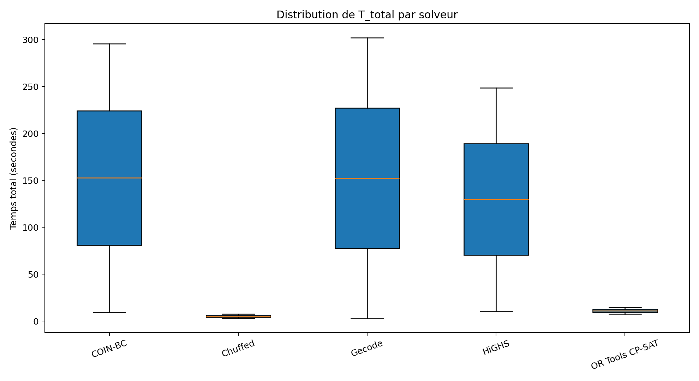
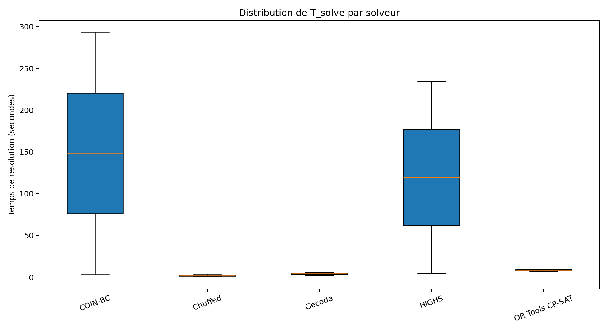
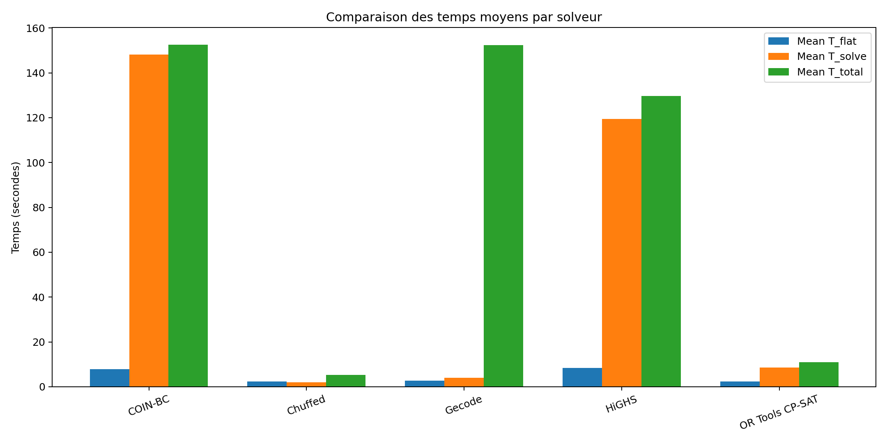
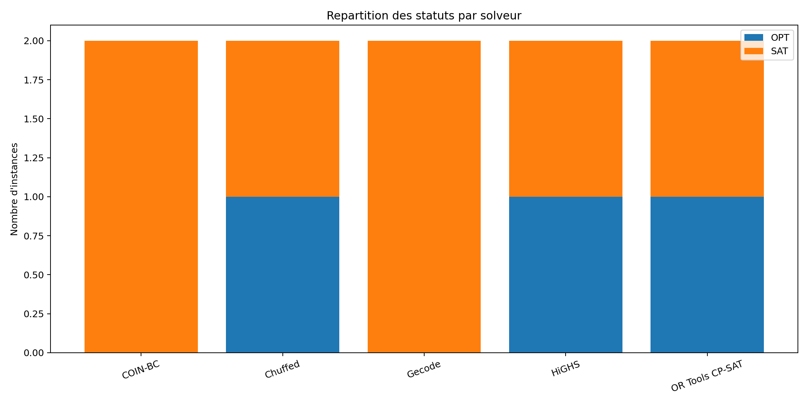
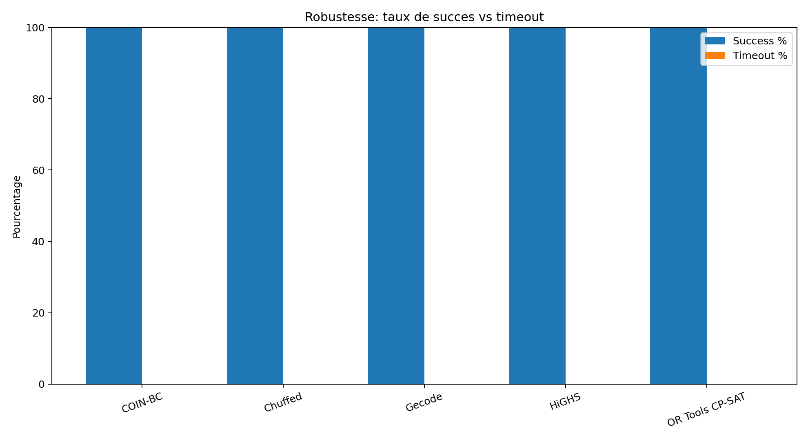
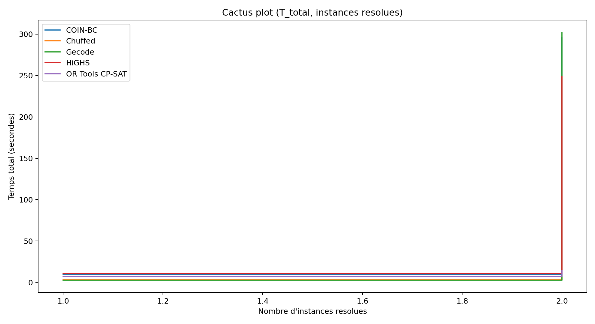

# Analyse Des Resultats De Benchmark

## Contexte

Cette campagne compare les solveurs MiniZinc suivants:
- Gecode
- Chuffed
- HiGHS
- OR Tools CP-SAT
- COIN-BC

Jeu de test utilise:
- 2 instances (`1` optimisation, `1` SAT)
- 10 runs solveur-instance au total

## Resume Executif

Classement global (temps total moyen `T_total`, plus petit = meilleur):

1. **Chuffed** (`5.20s`)
2. **OR Tools CP-SAT** (`11.02s`)
3. **HiGHS** (`129.73s`)
4. **Gecode** (`152.31s`)
5. **COIN-BC** (`152.55s`)

Conclusion rapide:
- **Meilleur compromis global: Chuffed** (le plus rapide en moyenne, et optimal sur le cas d'optimisation)
- **Meilleur sur SAT pur (instance testee): Gecode**

## Tableau De Classement

| Rang | Solveur | Mean T_total (s) | Median T_total (s) | Mean T_solve (s) | Success Rate |
|---|---|---:|---:|---:|---:|
| 1 | Chuffed | 5.20 | 5.20 | 2.02 | 100% |
| 2 | OR Tools CP-SAT | 11.02 | 11.02 | 8.50 | 100% |
| 3 | HiGHS | 129.73 | 129.73 | 119.46 | 100% |
| 4 | Gecode | 152.31 | 152.31 | 4.00 | 100% |
| 5 | COIN-BC | 152.55 | 152.55 | 148.12 | 100% |

## Lecture Figure Par Figure

### Figure 1 — `curve_01_boxplot_t_total.png`

Ce boxplot compare la distribution de `T_total` par solveur.
- Chuffed est nettement plus bas (meilleur) que les autres.
- OR Tools CP-SAT est deuxieme, avec des temps faibles.
- HiGHS, Gecode et COIN-BC sont beaucoup plus lents sur ce jeu.

Interpretation:
- **Pour minimiser le temps de bout en bout, Chuffed est le meilleur choix sur ces instances.**

### Figure 2 — `curve_02_boxplot_t_solve.png`

Ce boxplot isole le temps solveur (`T_solve`) sans le flattening.
- Chuffed et Gecode sont rapides en solve pur.
- OR Tools CP-SAT est intermediaire.
- HiGHS et COIN-BC sont fortement penalises par l'instance d'optimisation.

Interpretation:
- **La majeure partie de la lenteur de HiGHS/COIN-BC vient de la phase de recherche solveur.**

### Figure 3 — `curve_03_mean_times.png`

Cette figure compare `T_flat`, `T_solve`, `T_total` moyens.
- OR Tools et Chuffed ont de faibles `T_flat` et `T_total`.
- HiGHS et COIN-BC montrent des `T_solve` tres eleves.

Interpretation:
- **Le goulot principal n'est pas la compilation MiniZinc, mais le solve pour certains solveurs.**

### Figure 4 — `curve_04_status_stacked.png`

Repartition des statuts:
- Chuffed, HiGHS, OR Tools: `1 OPT + 1 SAT`
- Gecode, COIN-BC: `2 SAT` (pas de preuve d'optimalite sur le cas optimisation)

Interpretation:
- **Pour les problemes d'optimisation, Chuffed/OR Tools/HiGHS donnent une meilleure qualite de preuve (OPT).**

### Figure 5 — `curve_05_success_timeout_rates.png`

Tous les solveurs sont a 100% de succes sur ce lot (0 timeout, 0 erreur).

Interpretation:
- **La robustesse est equivalente sur cet echantillon; la discrimination se fait surtout sur la vitesse et le statut OPT.**

### Figure 6 — `curve_06_cactus_t_total.png`

Le cactus plot montre la vitesse de resolution cumulative.
- Courbe la plus favorable: Chuffed
- OR Tools suit de pres
- HiGHS/Gecode/COIN-BC progressent plus lentement

Interpretation:
- **Sur des campagnes plus larges, ce graphe est utile pour choisir le solveur qui "accumule" le plus vite des instances resolues.**

## Analyse Par Type De Probleme

### Cas optimisation (`10_Master_Test_10_with_preference.mzn`)
Classement par `T_total`:
1. Chuffed (`7.46s`, `OPT`)
2. OR Tools CP-SAT (`14.60s`, `OPT`)
3. HiGHS (`248.72s`, `OPT`)
4. COIN-BC (`295.47s`, `SAT`)
5. Gecode (`301.91s`, `SAT`)

Conclusion optimisation:
- **Chuffed est clairement le meilleur ici** (rapidite + preuve d'optimalite).

### Cas SAT (`10_master2_soutenances_jury_fixe_affectation_salle_test_10.mzn`)
Classement par `T_total`:
1. Gecode (`2.70s`, `SAT`)
2. Chuffed (`2.94s`, `SAT`)
3. OR Tools CP-SAT (`7.44s`, `SAT`)
4. COIN-BC (`9.63s`, `SAT`)
5. HiGHS (`10.75s`, `SAT`)

Conclusion SAT:
- **Gecode est legerement meilleur**, Chuffed est tres proche.

## Recommandation Finale

Avec ce benchmark actuel:
- **Solveur recommande par defaut: Chuffed**
  - Meilleur temps global
  - Meilleur comportement sur optimisation (OPT rapide)
- **Alternative SAT orientee vitesse: Gecode**

## Limite Scientifique (Importante)

Ce classement repose sur **2 instances seulement**.
Pour une conclusion solide de memoire/recherche:
- augmenter le nombre d'instances SAT et OPT,
- garder le meme timeout pour tous,
- comparer medianes + taux OPT + taux timeout.

